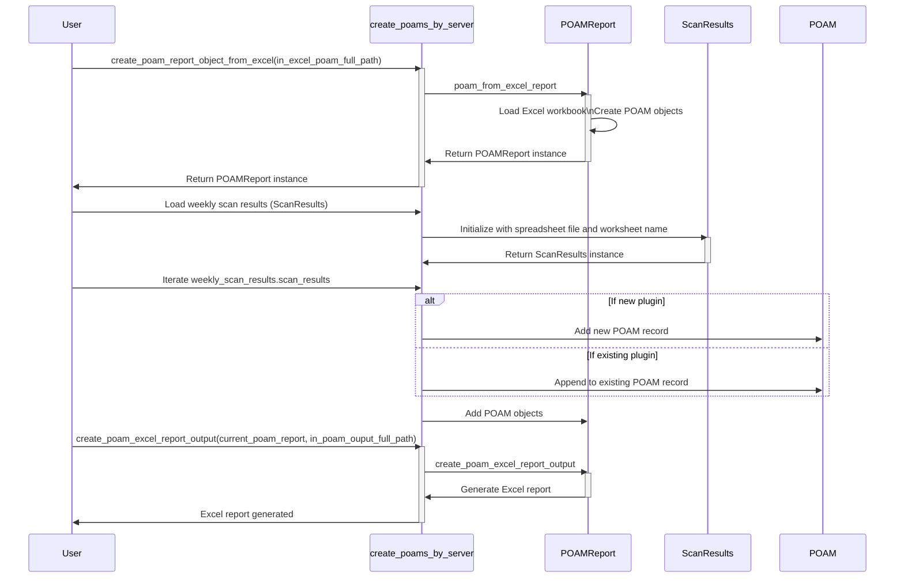

# Continuous Monitory and other processes that utilize spreadsheets, etc.

This project contains resources that utilize spreadsheets and other inputs to extract details related to security and continuous monitoring to create structure reports as well as other data structures related to continuous monitoring that could be utilized elsewhere.  A few key features include:

* The ability to create a CMDB (Configuration Management Database) inventory from an excel worksheet that contains details about CMDB items (Servers, software, etc.).  These inventories can be exported to various formats to be used elsewhere.  These inventories are often required for various regulatory requirements (e.g. FedRAMP, etc.).
* Functions and data structures related to vulnerability scan details.  This includes the ability to read in vulnerability scan results from an Excel spreadsheet and store in various structures for later use.  For example, vulnerability scan results are often required as part of periodic security artifacts (e.g. POAM, etc.) .
* Functionality related to creating and maintaining POAMs (Plans of Actions and Milestones).  These reports are often required to be provided on a periodic (e.g. monthly) as part of security related requirements.  For example, FedRAMP requires that a POAM report be created and provided on a monthly basis.  An example of included functionality is the ability to read POAM report data from an Excel worksheet, store the results in appropriate data structures and create outputs based on the information.  

## cmdb

System Inventory related scripts, etc.

### [create-cmdb-masters-from-fedramp-inventory.py](./cmdb/create-cmdb-masters-from-fedramp-inventory.py)

Contains functionality to create a valid CMDB inventory based on data in a valid Excel worksheet.  This also outputs the results into a JSON file.

#### Parameters/Constants

#### datetime_default

Formats a string into a valid ISO date time format.

* Inputs: obj - A string object to be formatted.
* Returns: obj.isoformat - An object in a valid ISO date/time format.

#### decompose_server_list

Using a regular express and split, takes in a string and splits it into an array containing a list of servers.  Assumes the servers are delimited by a return (\n) character.  Also replaces any "|" characters with an empty string

* Inputs: assets_impacted_in - A string containing 1 or more assets.
* Returns: server_out_result - An array/list of assets.


| Name                                                                                                  | Inputs/Outputs                                                                                | Description                                                                                                                                                                                                                    |
|:------------------------------------------------------------------------------------------------------|:----------------------------------------------------------------------------------------------|:-------------------------------------------------------------------------------------------------------------------------------------------------------------------------------------------------------------------------------|
| [create-cmdb-masters-from-fedramp-inventory.py](./cmdb/create-cmdb-masters-from-fedramp-inventory.py) | **++Inputs++**: Excel CMDB master file<br>**++Outputs++**: JSON file containing system inventory results. | This module will load the current OPEN CMDBS into a dictionary object and then create a JSON file containing system inventory information. <br>This JSON file is read by the [current_cmdb.py](./cmdb/current_cmdb.py) module. |
| [create-cmdb-output-frm-inventory.py](./cmdb/create-cmdb-output-frm-inventory.py)                     | **++Inputs++**: Excel CMDB master file<br>**++Outputs++**: JSON file containing system inventory results.     | This module will load the current OPEN CMDBS into a dictionary object and then create a JSON file containing system inventory information. <br>This JSON file is read by the [current_cmdb.py](cmdb\current_cmdb.py) module.   |
| [create-cmdb-masters-from-fedramp-inventory.py](cmdb/create-cmdb-masters-from-fedramp-inventory.py)   | Inputs: Excel CMDB master file<br>Outputs: JSON file containing system inventory results.     | This module will load the current OPEN CMDBS into a dictionary object and then create a JSON file containing system inventory information. <br>This JSON file is read by the [current_cmdb.py](cmdb\current_cmdb.py) module.   |
| [create-cmdb-masters-from-fedramp-inventory.py](cmdb/create-cmdb-masters-from-fedramp-inventory.py)   | Inputs: Excel CMDB master file<br>Outputs: JSON file containing system inventory results.     | This module will load the current OPEN CMDBS into a dictionary object and then create a JSON file containing system inventory information. <br>This JSON file is read by the [current_cmdb.py](cmdb\current_cmdb.py) module.   |

#### read_cmdb_excel

Reads in an Excel worksheet containing CMDB inventory items.  The worksheet records are used to create a dictionary object keyed on a unique identifier.

* Inputs: in_worksheet - An Excel worksheet containing CMDB items
* Returns: cmdb_results_out - A dictionary object.

```json
{
  "<cmdb_id>": {
    "<FIELD>":"<Value>"
  }
}
```


| Name                                                                                                  | Inputs/Outputs                                                                                | Description                                                                                                                                                                                                                    |
|:------------------------------------------------------------------------------------------------------|:----------------------------------------------------------------------------------------------|:-------------------------------------------------------------------------------------------------------------------------------------------------------------------------------------------------------------------------------|
| [create-cmdb-masters-from-fedramp-inventory.py](./cmdb/create-cmdb-masters-from-fedramp-inventory.py) | **++Inputs++**: Excel CMDB master file<br>**++Outputs++**: JSON file containing system inventory results. | This module will load the current OPEN CMDBS into a dictionary object and then create a JSON file containing system inventory information. <br>This JSON file is read by the [current_cmdb.py](./cmdb/current_cmdb.py) module. |
| [create-cmdb-output-frm-inventory.py](./cmdb/create-cmdb-output-frm-inventory.py)                     | **++Inputs++**: Excel CMDB master file<br>**++Outputs++**: JSON file containing system inventory results.     | This module will load the current OPEN CMDBS into a dictionary object and then create a JSON file containing system inventory information. <br>This JSON file is read by the [current_cmdb.py](cmdb\current_cmdb.py) module.   |
| [create-cmdb-masters-from-fedramp-inventory.py](cmdb/create-cmdb-masters-from-fedramp-inventory.py)   | Inputs: Excel CMDB master file<br>Outputs: JSON file containing system inventory results.     | This module will load the current OPEN CMDBS into a dictionary object and then create a JSON file containing system inventory information. <br>This JSON file is read by the [current_cmdb.py](cmdb\current_cmdb.py) module.   |
| [create-cmdb-masters-from-fedramp-inventory.py](cmdb/create-cmdb-masters-from-fedramp-inventory.py)   | Inputs: Excel CMDB master file<br>Outputs: JSON file containing system inventory results.     | This module will load the current OPEN CMDBS into a dictionary object and then create a JSON file containing system inventory information. <br>This JSON file is read by the [current_cmdb.py](cmdb\current_cmdb.py) module.   |

## conf

Configuration files.

## docs

Documentation

## model

objecct model definitions

## poam

POAM related utilities


### [create-poams_bu_server.py](./poam/create-poams_by_server.py)

Contains functionality to create a valid CMDB inventory based on data in a valid Excel worksheet.  This also outputs the results into a JSON file.

#### Parameters/Constants

#### datetime_default

Formats a string into a valid ISO date time format.

* Inputs: obj - A string object to be formatted.
* Returns: obj.isoformat - An object in a valid ISO date/time format.

#### decompose_server_list

Using a regular express and split, takes in a string and splits it into an array containing a list of servers.  Assumes the servers are delimited by a return (\n) character.  Also replaces any "|" characters with an empty string

* Inputs: assets_impacted_in - A string containing 1 or more assets.
* Returns: server_out_result - An array/list of assets.


| Name                                                                                                  | Inputs/Outputs                                                                                | Description                                                                                                                                                                                                                    |
|:------------------------------------------------------------------------------------------------------|:----------------------------------------------------------------------------------------------|:-------------------------------------------------------------------------------------------------------------------------------------------------------------------------------------------------------------------------------|
| [create-cmdb-masters-from-fedramp-inventory.py](./cmdb/create-cmdb-masters-from-fedramp-inventory.py) | **++Inputs++**: Excel CMDB master file<br>**++Outputs++**: JSON file containing system inventory results. | This module will load the current OPEN CMDBS into a dictionary object and then create a JSON file containing system inventory information. <br>This JSON file is read by the [current_cmdb.py](./cmdb/current_cmdb.py) module. |
| [create-cmdb-output-frm-inventory.py](./cmdb/create-cmdb-output-frm-inventory.py)                     | **++Inputs++**: Excel CMDB master file<br>**++Outputs++**: JSON file containing system inventory results.     | This module will load the current OPEN CMDBS into a dictionary object and then create a JSON file containing system inventory information. <br>This JSON file is read by the [current_cmdb.py](cmdb\current_cmdb.py) module.   |
| [create-cmdb-masters-from-fedramp-inventory.py](cmdb/create-cmdb-masters-from-fedramp-inventory.py)   | Inputs: Excel CMDB master file<br>Outputs: JSON file containing system inventory results.     | This module will load the current OPEN CMDBS into a dictionary object and then create a JSON file containing system inventory information. <br>This JSON file is read by the [current_cmdb.py](cmdb\current_cmdb.py) module.   |
| [create-cmdb-masters-from-fedramp-inventory.py](cmdb/create-cmdb-masters-from-fedramp-inventory.py)   | Inputs: Excel CMDB master file<br>Outputs: JSON file containing system inventory results.     | This module will load the current OPEN CMDBS into a dictionary object and then create a JSON file containing system inventory information. <br>This JSON file is read by the [current_cmdb.py](cmdb\current_cmdb.py) module.   |

#### read_cmdb_excel

Reads in an Excel worksheet containing CMDB inventory items.  The worksheet records are used to create a dictionary object keyed on a unique identifier.

* Inputs: in_worksheet - An Excel worksheet containing CMDB items
* Returns: cmdb_results_out - A dictionary object.

```json
{
  "<cmdb_id>": {
    "<FIELD>":"<Value>"
  }
}
```


| Name                                                                                                  | Inputs/Outputs                                                                                | Description                                                                                                                                                                                                                    |
|:------------------------------------------------------------------------------------------------------|:----------------------------------------------------------------------------------------------|:-------------------------------------------------------------------------------------------------------------------------------------------------------------------------------------------------------------------------------|
| [create-cmdb-masters-from-fedramp-inventory.py](./cmdb/create-cmdb-masters-from-fedramp-inventory.py) | **++Inputs++**: Excel CMDB master file<br>**++Outputs++**: JSON file containing system inventory results. | This module will load the current OPEN CMDBS into a dictionary object and then create a JSON file containing system inventory information. <br>This JSON file is read by the [current_cmdb.py](./cmdb/current_cmdb.py) module. |
| [create-cmdb-output-frm-inventory.py](./cmdb/create-cmdb-output-frm-inventory.py)                     | **++Inputs++**: Excel CMDB master file<br>**++Outputs++**: JSON file containing system inventory results.     | This module will load the current OPEN CMDBS into a dictionary object and then create a JSON file containing system inventory information. <br>This JSON file is read by the [current_cmdb.py](cmdb\current_cmdb.py) module.   |
| [create-cmdb-masters-from-fedramp-inventory.py](cmdb/create-cmdb-masters-from-fedramp-inventory.py)   | Inputs: Excel CMDB master file<br>Outputs: JSON file containing system inventory results.     | This module will load the current OPEN CMDBS into a dictionary object and then create a JSON file containing system inventory information. <br>This JSON file is read by the [current_cmdb.py](cmdb\current_cmdb.py) module.   |
| [create-cmdb-masters-from-fedramp-inventory.py](cmdb/create-cmdb-masters-from-fedramp-inventory.py)   | Inputs: Excel CMDB master file<br>Outputs: JSON file containing system inventory results.     | This module will load the current OPEN CMDBS into a dictionary object and then create a JSON file containing system inventory information. <br>This JSON file is read by the [current_cmdb.py](cmdb\current_cmdb.py) module.   |



## util

General utilities

## vdrf

Deviation requests

## vulnerabilitiy_scans

Scripts for processing nessus/tenable vulnerability scan data.

[current_vuln_scan.py](vulnerability_scans/current_vuln_scan.py): Module
that can be imported to accesss CMDB JSON data/file as well as functions
for accessing the CMDB data.
* Inputs: CMDB JSON File, set as a variable/constant
* Variables/Contants
  * ENVIRONMENT: L5 or FRM
  * VULN_SCAN_FILE_JSON: JSON File containing vuln scan results data.
* Outputs/Results: None

[create_vuln_scan_results_from_spreadsheet.py](vulnerability_scans/create_vuln_scan_results_from_spreadsheet.py):
Reads the "All Items" sheet from the excel spreadsheet containing
vulnerability scan data.
* Inputs: Excel spreadsheet with All Items worksheet.
* Variables/Contants
  * SCAN_RESULTS_SHEET_NAME: "All Items"
  * VULN_SCAN_OUTPUT_FILE_JSON: Output JSON file name from Vuln Scan
    data.
* Outputs/Results: JSON file containing vulnerability scan data.

[process_csv_nessus_results.py](vulnerability_scans/process_csv_nessus_results.py):
Reads a .csv file containing nessus scan data and prints/extracts
details as needed.
* Inputs: CSV file containing nessus scan results
* Outputs/Results: N/A

[process_nessue_xml_file.py](vulnerability_scans/process_nessue_xml_file.py):
process raw .nesssus file and extract information related to the scan.
This includes items such as plugins, targets, policy used, etc.
* Inputs: Raw .nessus file
* Outputs/Results: Prints summary information about the scan result.
